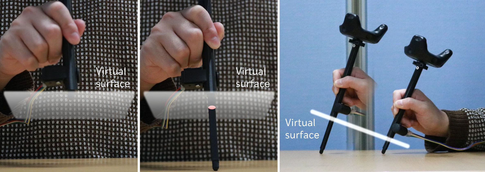
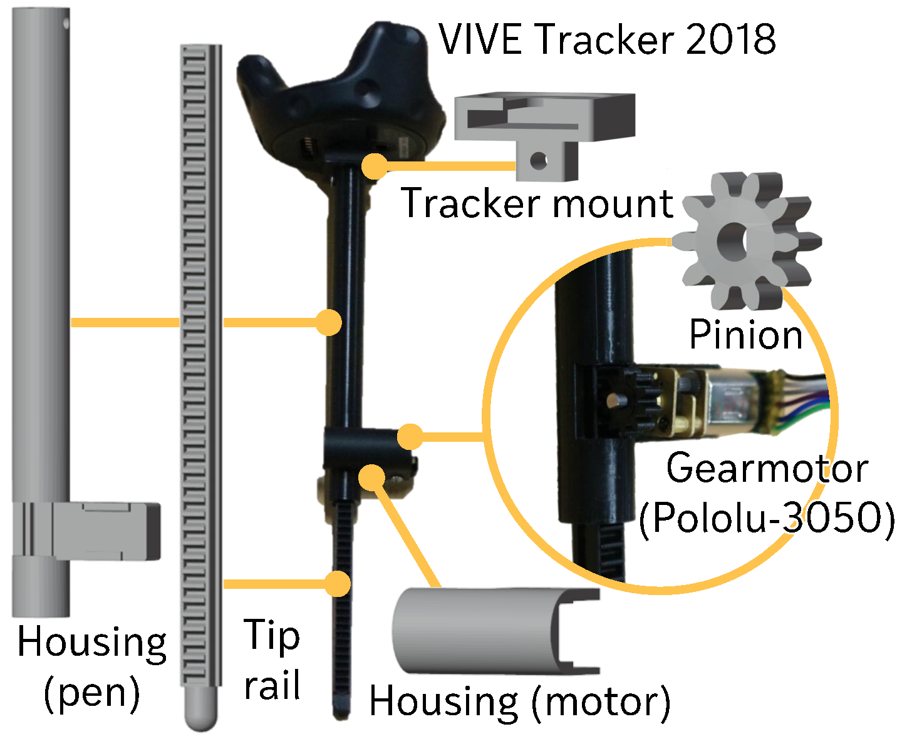

# Pen Meets Desk: Above-surface Drawing with Encountered-type Haptics Using an Extendable Pen
Repository for a paper entitled "Pen Meets Desk: Above-surface Drawing with Encountered-type Haptics Using an Extendable Pen", which is accepted to Journal of Information Processing.

# Overview
Hand drawing in immersive virtual environments works best on a virtual surface aligned with a counterpart physical surface. However, physical surfaces are rarely portable and therefore hard-to-align with the virtual surfaces in
the air. To overcome this limitation, we propose a mechanical pen device that changes the length to render encountered haptic feedback. We evaluated our proof-of-concept device in a user study and published the 3D printable data for
reproducibility. We designed a trajectory tracing task on 0-/15-/30-degree slanted canvases and compared drawing with and without our encountered haptic rendering in terms of tracing accuracy, usability, and workload. The results
revealed that our method has the potential to afford better line tracing performance and reduce workload. We discuss how precise device length controls can contribute to improving usability and decreasing workload on a steep canvas.



# Contents
This repository includes a code of Arduino to control pen device length and 3D models of pen device. The pen device consists of five 3D-printed parts contained in the [hardware directory](hardware), a gear motor ([50:1 Micro Metal Gearmotor HPCB 12V with Extended Motor Shaft](https://www.pololu.com/product/3050)) with a magnetic encoder ([Magnetic Encoder Pair Kit for Micro Metal Gearmotors](https://www.pololu.com/product/3081)), and a VR tracker (VIVE Tracker 2018).
```
.
├── Arduino/                       
│   └── RackExtensionControl.ino   # Code for Arduino
├── hardware/                      
│   ├── extension_rack.stl         # Tip rail
│   ├── motor_cover.stl            # Housing (motor)
│   ├── pinion.stl                 # pinion
│   ├── rack_cover.stl             # Housing (pen)
│   └── tracker_joint.stl          # Tracker mount
```


# Citations
If you find our work useful in your research, please consider citing our paper: 
```
@article{ExtickTouch_JIP2026,
  title={Pen Meets Desk: Above-surface Drawing with Encountered-type Haptics Using an Extendable Pen},
  author={Fumihiko Nakamura and Yuki Takanaga and Hinata Miyauchi and Yuta Kataoka and Shohei Mori and Fumihisa Shibata and Asako Kimura},
  journal={Journal of Information Processing},
  volume={34},
  number={1},
  pages={XX--XX},
  year={2026},
  doi={To be apperared}
}
```
